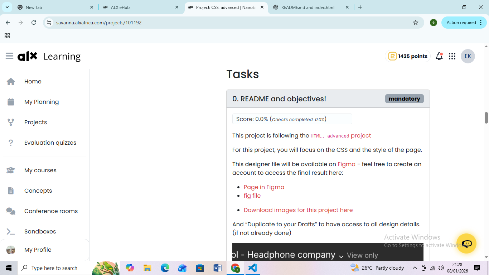

# CSS Advanced Project

## Project Overview
This project is part of the HTML & CSS advanced curriculum at ALX. The goal of this project is to practice advanced CSS styling, selectors, box properties, and layout techniques using only HTML, CSS, and JavaScript.

You will be required to:
- Apply CSS to style elements effectively.
- Use classes and selectors correctly.
- Understand and apply CSS specificity rules.
- Work with box properties such as margin, padding, border, and width/height.
- Ensure the webpage is W3C compliant.

---

## Visual Preview



> Above is a preview of how the project should look when opened in a browser.

---

## Learning Objectives
By completing this project, you should be able to:
- Explain what CSS is and how it works.
- Add style to HTML elements.
- Create and use classes and selectors.
- Compute CSS specificity values.
- Apply box properties effectively.
- Understand how the browser loads a webpage.

---

## Project Requirements
- All files must end with a newline.
- No external libraries or frameworks (like Bootstrap, React, NodeJS, etc.) are allowed.
- Code must be W3C compliant and pass validation.
- Images, fonts, and other assets should be added to relevant folders.
- Follow the Figma design file for layout and style guidance.

---

## Folder Structure


---

## How to View the Project
1. Clone the repository:  
   ```bash
   git clone https://github.com/emmily26/alx_html_css.git


